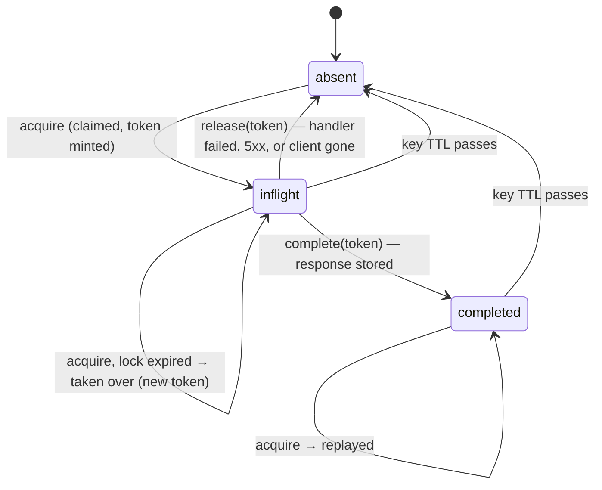
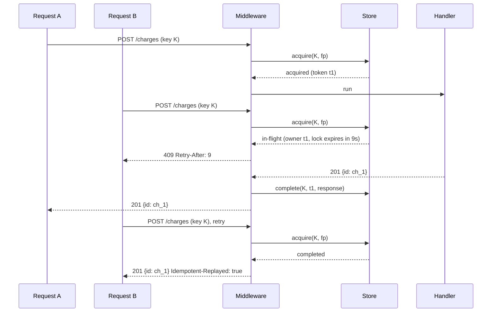

# idempotency-kit

[](https://github.com/mohadjillani/idempotency-kit/actions/workflows/ci.yml)
[](https://www.npmjs.com/package/@mohadjillani/idempotency-kit)
[](LICENSE)

**Make any endpoint safe to retry.** Idempotency keys for Node.js HTTP services: an explicit request state machine, atomic acquire so two identical requests can never both run, byte-for-byte response replay, and an Express binding. Zero runtime dependencies in the core; Redis and MongoDB stores as separate packages.

```sh
npm install @mohadjillani/idempotency-kit
```

```ts
import express from 'express';
import { MemoryStore } from '@mohadjillani/idempotency-kit';
import { idempotency } from '@mohadjillani/idempotency-kit/express';

const app = express();
app.use(express.json());
app.use('/charges', idempotency({ store: new MemoryStore(), required: true }));
app.post('/charges', (req, res) => res.status(201).json(chargeCard(req.body)));
```

A client that sends `Idempotency-Key: <uuid>` and retries — because of a timeout, a double click, a flaky network — gets the first response back with `Idempotent-Replayed: true`. The card is charged once.

## Overview

Retries are how distributed systems stay available, and every retry of a non-idempotent request is a potential duplicate side effect. Payment APIs solved this years ago with a client-supplied key; most services that copy the idea get the easy part right (store the response, replay it) and the hard part wrong (what happens when the same key arrives twice at the same time, when the handler fails, when the store is down). This library is the hard part, written once:

- **A key is a state machine**: `absent → in-flight → completed`, with `replayed` as the outcome for a completed key seen again. Transitions are pure functions in [`state.ts`](packages/core/src/state.ts) and property-tested with fast-check.
- **`acquire` is one atomic operation** in every store — Lua in Redis, an `_id` upsert in MongoDB, a synchronous `Map` update in memory — so there is no read-then-write window for two requests to slip through. Each claim carries a fencing token; a caller whose lock expired cannot overwrite the result of the one that took over.
- **The same key twice at once** is rejected with `409` and `Retry-After` by default, or waits for the first request's result with `onConflict: 'wait'`.
- **The same key with a different body** is `422`, not a silently wrong replay.
- **Handler failures release the key**, so a retry runs again instead of replaying a 500 for a day. `4xx` is kept by default (a decline is deterministic); `shouldStore` changes that.
- **Store down means fail closed** (`503`) unless an endpoint opts into `failOpen`.
- **Abandoned locks expire.** A process that dies mid-handler leaves an in-flight record that becomes claimable after `lockTtlMs`, well before the key's own TTL.

The core is transport-neutral — `handle(key, fingerprint, execute)` — so the same semantics apply to a queue consumer or another framework. The Express binding adds header parsing, scoping, fingerprinting and response capture.

| Package                                 | What it is                                            |
| --------------------------------------- | ----------------------------------------------------- |
| `@mohadjillani/idempotency-kit`         | Core, `MemoryStore`, and the `./express` middleware   |
| `@mohadjillani/idempotency-kit-redis`   | `RedisStore` on `ioredis` (^5 or ^6), Lua transitions |
| `@mohadjillani/idempotency-kit-mongodb` | `MongoStore` on the official driver (^6 or ^7)        |

Node 20 or newer; ESM and CommonJS; Express 5 for the binding.

## How a key moves



Two requests with the same key arriving together, reject policy:



## Semantics

The short version; every row and the state table are in [`docs/SEMANTICS.md`](docs/SEMANTICS.md).

| Key state               | Fingerprint | Policy   | Result                                                                 |
| ----------------------- | ----------- | -------- | ---------------------------------------------------------------------- |
| absent or expired       | —           | any      | handler runs, response stored                                          |
| in-flight               | same        | `reject` | `409` + `Retry-After`                                                  |
| in-flight               | same        | `wait`   | replay when the owner finishes; take over if it dies; `409` on timeout |
| in-flight               | different   | any      | `422`                                                                  |
| in-flight, lock expired | any         | any      | handler runs (takeover)                                                |
| completed               | same        | any      | original status, headers, body + `Idempotent-Replayed: true`           |
| completed               | different   | any      | `422`                                                                  |
| store unreachable       | —           | any      | `503` (`failOpen: true` runs the handler unprotected)                  |

After the handler: response kept when `shouldStore` says so (Express default: status below 500); otherwise the key is released and the next request runs the handler again. A thrown error or a client disconnect also releases.

## Stores

```ts
// Memory: one process, tests, development
import { MemoryStore } from '@mohadjillani/idempotency-kit';
const store = new MemoryStore();

// Redis: shared across replicas, expiry handled by Redis
import { Redis } from 'ioredis';
import { RedisStore } from '@mohadjillani/idempotency-kit-redis';
const store = new RedisStore(new Redis(process.env.REDIS_URL), { prefix: 'idem:' });

// MongoDB: one document per key, TTL index for expiry
import { MongoClient } from 'mongodb';
import { MongoStore } from '@mohadjillani/idempotency-kit-mongodb';
const client = await MongoClient.connect(process.env.MONGODB_URL);
const store = new MongoStore(client.db('app').collection('idempotency_keys'));
```

The contract is four methods — `acquire`, `complete`, `release`, `get` — described in [`docs/API.md`](docs/API.md). A new backend is done when it passes [`packages/store-contract`](packages/store-contract/src/contract.ts), the suite all three of these run, including the fifty-way concurrent acquire.

## Express usage

```ts
app.use(
  '/api',
  idempotency({
    store,
    required: true, // 400 without a key; default false lets keyless requests through unprotected
    scope: (req) => req.auth.accountId, // keys are per account, never shared across tenants
    ttlMs: 24 * 60 * 60 * 1000, // remember keys for a day
    lockTtlMs: 30_000, // longer than the slowest handler
    onConflict: 'reject', // or 'wait' with wait: { timeoutMs, pollIntervalMs }
    shouldStore: (r) => r.status < 500, // default: keep 2xx/3xx/4xx, release on 5xx
    onStoreError: (err, { key, operation }) =>
      log.error({ err, key, operation }, 'idempotency store'),
  }),
);
```

Mount it after the body parser: the default fingerprint hashes method, URL and `req.body`. Problem responses are JSON `{ error, message }` — override `render` to match your API's error shape. The whole response body is buffered for replay; keep this off streaming endpoints.

## The core without Express

```ts
import { createIdempotency, fingerprint, MemoryStore } from '@mohadjillani/idempotency-kit';

const idem = createIdempotency({ store: new MemoryStore(), lockTtlMs: 10_000 });

const outcome = await idem.handle(message.id, fingerprint(message.payload), () =>
  processPayment(message.payload),
);
// outcome.outcome: 'executed' | 'replayed' | 'in-flight' | 'mismatch' | 'store-unavailable'
```

## Testing

The headline test is the race in [`packages/store-contract/src/race.ts`](packages/store-contract/src/race.ts): fifty simultaneous `POST`s with one key against a real Express server over TCP, on each store, must execute the handler exactly once. Output from `npm test` on this machine with Redis and MongoDB configured:

```
race[memory][reject]:  1 execution, 1x201 49x409, 0 replayed
race[memory][wait]:    1 execution, 50x201, 49 replayed
race[redis][reject]:   1 execution, 1x201 49x409, 0 replayed
race[redis][wait]:     1 execution, 50x201, 49 replayed
race[mongodb][reject]: 1 execution, 1x201 49x409, 0 replayed
race[mongodb][wait]:   1 execution, 50x201, 49 replayed
```

```sh
npm test                                   # unit, property, contract, race on memory; Redis skips, MongoDB uses mongodb-memory-server
docker compose up -d                       # or point at your own
REDIS_URL=redis://127.0.0.1:6379 MONGODB_URL=mongodb://127.0.0.1:27017 npm test
npm run demo                               # builds, then runs the scripted double submit in examples/express-payments
```

Beyond the race: fast-check drives random `acquire`/`complete`/`release` sequences with a moving clock through the state machine and checks that a key is only claimed when absent, expired or holding an expired lock, that a completed key always replays the same response, that only the current token can complete or release, and that no transition outside the state table ever occurs. The store contract suite runs against memory, Redis and MongoDB so the backends cannot drift from each other. CI runs everything on Node 20, 22 and 24, with `redis:7` and `mongo:7` service containers for the integration job.

Not tested, and stated as limits below: clock skew between application processes, and Redis Cluster.

## Overhead

From [`bench/README.md`](bench/README.md), generated by `npm run bench` (autocannon, memory store, ten seconds per row, Apple M1 / 8 GB / Node 23, local run):

| Scenario                           | req/s | p99 ms | vs baseline | handler runs |
| ---------------------------------- | ----: | -----: | ----------: | -----------: |
| baseline (no middleware)           | 11466 |    2.0 |        100% |       114673 |
| middleware, unique key per request |  9195 |    3.0 |         80% |        91960 |
| middleware, replay of one key      | 11645 |    2.0 |        102% |            0 |

That is the ceiling of the middleware's share on an endpoint that does nothing else; a handler that reaches a database or a payment gateway dwarfs it, and a network store adds its round trips on top.

## Design decisions

Each is an ADR in [`docs/adr/`](docs/adr):

1. [Reject by default for concurrent same-key requests](docs/adr/0001-reject-by-default-for-concurrent-same-key-requests.md) — a concurrent duplicate is a client bug; `409` makes it visible and costs one store call, waiting hides it and holds a connection.
2. [Atomic acquire as the store contract](docs/adr/0002-atomic-acquire-as-the-store-contract.md) — check-then-set across two calls is the double charge; atomicity lives in the store, and fencing tokens keep a stale owner from overwriting a takeover.
3. [Fail closed when the store is down](docs/adr/0003-fail-closed-when-the-store-is-down.md) — the promise is "no double effects"; running unprotected breaks it silently. `failOpen` is for endpoints where a duplicate is cheap.
4. [Changesets over semantic-release for a workspace](docs/adr/0004-changesets-over-semantic-release-for-a-workspace.md) — three packages version independently.

Why fingerprint at all: a reused key with a different body is a bug or an attack, and replaying the old response would be silently wrong. Why not cache 5xx: a transient failure replayed for the TTL turns a blip into an outage for that key. Why a framework-agnostic core: the state machine has nothing to do with HTTP framing, and keeping it pure is what makes it property-testable.

Key entropy, scoping and what the store holds are covered in [`SECURITY.md`](SECURITY.md).

## Limits

- **Clocks.** TTL arithmetic uses each application process's clock (Redis expiry itself uses the server's). Processes with skewed clocks disagree about when a lock is abandoned; keep NTP running and `lockTtlMs` generous.
- **Lock expiry under a slow handler still means a second execution.** The fencing token decides whose response is kept, not whether the second run happens. Set `lockTtlMs` above the slowest legitimate handler.
- **Responses are buffered whole.** No streaming replay, and large bodies cost memory in the store.
- **Redis: single node or Sentinel.** Every script touches one key so Cluster should work, but it is not tested.
- **MongoDB's TTL monitor runs about once a minute**, so expired documents linger briefly; reads apply expiry themselves, so behaviour is unaffected.
- **The memory store is per process.** Two replicas with memory stores protect nothing across each other.

## Future improvements

- A PostgreSQL store (`INSERT … ON CONFLICT` makes acquire a single statement).
- A Fastify binding over the same core.
- Optional streaming capture for bodies above a size threshold, storing a digest and refusing to replay instead of buffering.
- Metrics hooks (counts per outcome) so a dashboard can show duplicate rates.

## Related

- [`webhook-receiver-kit`](https://github.com/mohadjillani/webhook-receiver-kit) and [`stripe-flows-reference`](https://github.com/mohadjillani/stripe-flows-reference) consume this package for at-least-once webhook delivery and payment retries.
- [`socketio-scale-template`](https://github.com/mohadjillani/socketio-scale-template) applies the same at-least-once reasoning to socket events.

## License

MIT © Mohad Jillani
